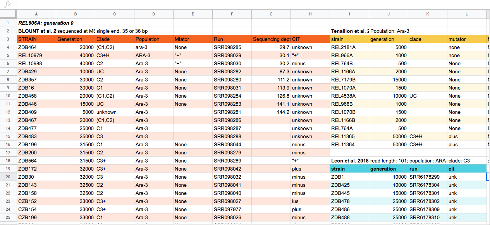

# Introduction

When we think about the data for a sequencing project, we often start by thinking about 
the sequencing data that we get back from the sequencing center, but just as important, 
if not more so, is the data you've generated about the sequences before they ever go to 
the sequencing center. This is the data about the data, often called the metadata. 
Without the information about what you sequenced, the sequence data itself is useless.  

> ## Discussion 1
> With the person next to you, discuss:
>
> What kinds of data and information have you generated before you sent your DNA/RNA off for sequencing?
>
> > ## Solution
> > Types of files and information you have generated:  
> > - Spreadsheet or tabular data with the data from your experiment and 
> >   whatever you were measuring for your study.
> > - Lab notebook notes about how you conducted those experiments.
> > - Spreadsheet or tabular data about the samples you sent off for sequencing. 
> > Sequencing centers often have a particular format they need 
> > with the name of the sample, DNA concentration and other information.
> > - Lab notebook notes about how you prepared the DNA/RNA for sequencing and what 
> > type of sequencing you're doing, e.g. paired end Illumina HiSeq.
> > There likely will be other ideas here too.
> > Was this more information and data than you were expecting?
> > 
> {: .solution}
{: .challenge}

All of the data and information just discussed can be considered metadata, 
i.e. data about the data. We want to follow a few guidelines for metadata.

## Notes

Notes about your experiment, including how you prepared your samples for sequencing, 
should be in your lab notebook, whether that's a physical lab notebook or electronic lab notebook. 
For guidelines on good lab notebooks, see the Howard Hughes Medical Institute 
"Making the Right Moves: A Practical Guide to Scientifıc Management for Postdocs and New Faculty" 
section on [Data Management and Laboratory Notebooks](http://www.hhmi.org/sites/default/files/Educational%20Materials/Lab%20Management/Making%20the%20Right%20Moves/moves2_ch8.pdf).

Including dates on your lab notebook pages, the samples themselves and in
any records about those samples helps you associate everything with each
other later. Using dates also helps create unique identifiers, because even
if you process the same sample twice, you don't usually do it on the same
day, or if you do, you're aware of it and give them names like A and B.

> ## Unique identifiers
> Unique identifiers are a unique name for a sample or set of sequencing data.
> They are names for that data that only exist for that data. Having these
> unique names makes them much easier to track later.
{: .callout}

## Data about the experiment

Data about the experiment is usually collected in spreadsheets, like Excel. The file containing this experiment information is often called **README**. Having this information is very convenient when you're working on a team and more people start to join the project even at different steps of the experiment. This may help better your collaborators to easy understand what the data is about. 

What type of data to collect depends on your experiment and there are often guidelines from metadata standards. The Cornell University gives us a useful [guide](https://data.research.cornell.edu/content/readme#dataspecific) to learn how to write a README. You can check the template in the following [file](https://github.com/nselem/organization-metagenomics/blob/master/files/AUTHOR_DATASET_ReadmeTemplate.txt)

> ## Discussion 2
> Now that we have learned the format and the importance of the **README** file. Work in teams and discuss the main helpful tips to make your own data file in Excel. [Here](../files/01_MGRAST_DATA.xlsx) you can access to the data file information. Use the template and modify the different sheets to facilitate your work.
>
>
>> ## Solution
>> Make sure your data can be correctly interpreted, by yourself at a later date or by others when sharing or publishing data. If there are no standards, a "readme" file is always an appropiate strategy. Here you can check a [Guide to writing "readme"](https://data.research.cornell.edu/content/readme#dataspecific) by Cornell University.  
>> 
> {: .solution}
{: .challenge}

> ## Metadata standards
> Many fields have particular ways that they structure their metadata so it's
consistent and can be used across the field.
>
> The Digital Curation Center maintains [a list of metadata  standards](http://www.dcc.ac.uk/resources/metadata-standards/list) 
> and some that are particularly relevant for genomics data are available from the [Genomics Standards Consortium](http://gensc.org/projects/).
> In particular, assembly quality and an estimate of genome completeness and contamination are [standars for Metagenome-Assambled-Genomes](https://www.nature.com/articles/nbt.3893) (MAGs).  
>
> If there aren't metadata standards already, you can think about what the 
> minimum amount of information is that someone would need to know about your data 
> to be able to work with it, without talking to you.
>
{: .callout}

### Structuring data in spreadsheets

Independent of the type of data you're collecting, there are standard ways to enter that data 
into the spreadsheet, to make it easier to analyze later. We often enter data that makes it easy 
for us as humans to read and work with it, because we're human! Computers need data structured in 
a way that they can use it. So to use this data in a computational workflow, we need to think 
like computers when we use spreadsheets.

The cardinal rules of using spreadsheet programs for data:

- Leave the raw data raw - don’t change it!
- Put each observation or sample in its own row.
- Put all your variables in columns - the thing that vary between samples, like ‘strain’ or ‘DNA-concentration’.
- Have column names be explanatory, but without spaces. Use '-', '_' or 
- [camel case](https://en.wikipedia.org/wiki/Camel_case) instead of a space. For instance 'library-prep-method' or 'LibraryPrep'is better than 'library preparation method' or 'prep', because computers interpret spaces in particular ways.
- Don’t combine multiple pieces of information in one cell. Sometimes it just seems like one thing, but think if that’s the only way
you’ll want to be able to use or sort that data. For example, instead of having a column with species and strain name (e.g. *E. coli* 
K12) you would have one column with the species name (*E. coli*) and another with the strain name (K12). Depending on the type of 
analysis you want to do, you may even separate the genus and species names into distinct columns.
- Export the cleaned data to a text-based format like CSV (comma-separated values) format. This ensures that anyone can use the data, and is required by most data repositories.

> ## Discussion 3
> This is a potential spreadsheet data generated about a sequencing experiment. With the person next to you, for about 2 minutes, discuss some of the problems with the spreadsheet data shown above. You can look at the image, or download the file to your computer via this [link](https://github.com/datacarpentry/organization-genomics/raw/gh-pages/files/Ecoli_metadata_composite_messy.xlsx) and open it in a spreadsheet reader like Excel. 
>
>
> > ## Solution
> > There are a few potential errors to be on the lookout for in your own data as well as data from collaborators or the Internet. If you are aware of the errors and the possible negative effect on downstream data analysis and result interpretation, it might motivate yourself and your project members to try and avoid them. Making small changes to the way you format your data in spreadsheets can have a great impact on efficiency and reliability when it comes to data cleaning and analysis.
> >
> > - Using multiple tables
> > - Using multiple tabs
> > - Not filling in zeros
> > - Using problematic null values
> > - Using formatting to convey information
> > - Using formatting to make the data sheet look pretty
> > - Placing comments or units in cells
> > - Entering more than one piece of information in a cell
> > - Using problematic field names
> > - Using special characters in data
> > - Inclusion of metadata in data table
> > - Date formatting
> > 
> > You can keep exploring issues on metadata file in the [Data Carpentry Ecology spreadsheet lesson](http://www.datacarpentry.org/spreadsheet-ecology-lesson/02-common-mistakes/). Not all are present in this example. Discuss with the group what they found. Some problems include not all data sets having the same columns, datasets split into their own tables, color to encode information, different column names, spaces in some columns names. Here is a "clean" version of the same spreadsheet:
> >
> > [Cleaned spreadsheet](https://raw.githubusercontent.com/datacarpentry/wrangling-genomics/gh-pages/files/Ecoli_metadata_composite.tsv)
> > Download the file using right-click (PC)/command-click (Mac). 
> >
> {: .solution}
{: .challenge}

## Further notes on data tidiness

Data organization at this point of your experiment will help facilitate your analysis later, as well as prepare your data and notes for data deposition now often required by journals and funding agencies. If this is a collaborative project, as most projects are now, it's also information that collaborators will need to interpret your data and results and is very useful for communication and efficiency.

Fear not! If you have already started your project, and it's not set up this way, there are still opportunities to make updates. One of the biggest challenges is tabular data that isn't formatted so computers can use it, or has inconsistencies that make it hard to analyze.

More practice on how to structure data is outlined in our [Data Carpentry Ecology spreadsheet lesson](http://www.datacarpentry.org/spreadsheet-ecology-lesson/02-common-mistakes/)

Tools like [OpenRefine](http://www.datacarpentry.org/OpenRefine-ecology-lesson/) can help you clean your data.
