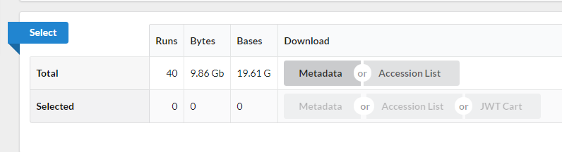

In our experiments we usually think about generating our own sequencing data. However, almost all analyses use reference data, and you may want to use it to compare your results or annotate your data with publicly available data. You may also want to do a full project or set of analyses using publicly available data. This data is a great, and essential, resource for genomic data analysis.

When you come to publish a paper including your sequencing data, most journals and funders require that you place your data on a public repository. Sharing your data makes it more likely that your work will be re-used and cited. It helps to prepare for this early!

There are many repositories for public data. Some model organisms or fields have specific databases, and there are ones for particular types of data. Two of the most comprehensive public repositories are provided by the [National Center for Biotechnology Information  (NCBI)](https://www.ncbi.nlm.nih.gov) and the [European Nucleotide Archive (EMBL-EBI)](https://www.ebi.ac.uk/). The NCBI's [Sequence Read Archive (SRA)](https://trace.ncbi.nlm.nih.gov/Traces/sra/) is the database we will be using for this lesson, but the EMBL-EBI's Nucleic Acid Archive (ENA) is also useful. The general processes are similar for any database.

# Accessing the original archived data

The [sequencing dataset (from Okie, *et al.* 2020) adapted for this workshop](https://zenodo.org/record/4285901#.YFtEAq9KjIU) was obtained from the [NCBI Sequence Read Archive](http://www.ncbi.nlm.nih.gov/sra), which is a large (~27 petabasepairs/2.7 x 10^16 basepairs as of April 2019) repository for next-generation sequence data. Like many NCBI databases, it is complex and mastering its use is greater than the scope of this lesson. Very often there will be a direct link (perhaps in the supplemental information) to where the SRA dataset can be found. We are only using a small part of these data, so a direct link cannot be found. If you have time, go through the following detailed description of finding the data we are using today (otherwise skip to the next section). 

## Locate the Run Selector Table for the Okie Dataset on the SRA

See the figures below for how information about data access is provided within the original paper. 

The **next image** shows the title of the study, as well as the authors.

The **image below** shows an excerpt from the paper that includes information on how to locate the sequence data. In this case, the text appears just before the reference section.

1. Notice that the paper references "PRJEB22811" as a "BioProject" at NCBI. If you go to the [NCBI website](https://www.ncbi.nlm.nih.gov/) and search for "PRJEB22811" you will be shown a link to the "Cuatro Cienegas Lagunita Fertilization Experiement" BioProject. Here is the link to that database: [https://www.ncbi.nlm.nih.gov/bioproject/?term=PRJEB22811](https://www.ncbi.nlm.nih.gov/bioproject/?term=PRJEB22811).

2. Once on the BioProject page, scroll down to the table under **"Project information:"**. *"[PRJEB22811](https://www.ncbi.nlm.nih.gov/bioproject/PRJEB22811/)*. 

3. This will take you to a page with a table **"Project Data"** 
that has a link to the 40 SRA files for this subproject. 

4. Click on the number 
["40"](https://www.ncbi.nlm.nih.gov/sra?linkname=bioproject_sra_all&from_uid=420272) and it will take you to the SRA page for this subproject. 

5. For a more organized table, go to ["SRA Run"](https://www.ncbi.nlm.nih.gov/Traces/study/) and type the BioProject accession ID. This will be used in the next section. The run selector is being updated, at this point you can either use the redesigned SRA Run Selector (recommended) or revert to the old Run Selector.

## Download the Okie SRA data from the (newer) SRA Run Selector Table

1 Make sure you access the dataset from the provided link: [https://www.ncbi.nlm.nih.gov/Traces/study/?acc=%20PRJEB22811&o=acc_s%3Aa](https://www.ncbi.nlm.nih.gov/Traces/study/?acc=%20PRJEB22811&o=acc_s%3Aa). This is NCBI’s new cloud-based SRA interface. You will be presented with a page for the overall BioProject accession PRJEB22811 - this is a collection of all the experimental data. 

2 At the top of the page is an option to switch back to the “old Run Selector”. We will discuss that later.

3 Notice on this page there are three sections. “Common Fields” “Select”, and “Found 40 Items”. Within “Found 40 Items”, click on the first Run number (Column “Run”, Row “1”). 

4 This will take you to a page that is a run browser. Take a few minutes to examine some of the descriptions on the page.

5 Use the browser’s back button to go back to the 'previous page'. As shown in the figure below, the second section of the page (“Select”) has the **Total** row showing you the current number of “Runs”, “Bytes”, and “Bases” in the dataset to date. On 2012-06-27 there were 40 runs, 9.86 GBytes of data, and 19.61 Gbases of data. 

6. Click on the “Metadata” button to download the data for this lesson. The filename is “SraRunTable.txt” and save it on your computer Desktop.

> ## Downloading the Okie SRA data from the SRA Run Selector Table using the old Run Selector
> 
> Go to the [“old Run Selector” ](https://www.ncbi.nlm.nih.gov/Traces/study1/?query_key=1&WebEnv=MCID_605b7fb46f5f14319c387ae3&o=acc_s%3Aa) at the top of the page. Download your `SraRunTable.txt` file by clicking in **"RunInfo Table"**. 
> 
> We include the “old Run Selector” page because the webpages ***and*** downloaded file `SraRunTable.txt` are slightly different. 
{: .callout}

**You should now have a file called `SraRunTable.txt`**

## Review the SraRunTable in a spreadsheet program

Using your choice of spreadsheet program, open the `SraRunTable.txt` file. If prompted by the spreadsheet software be aware that the ***newer***  NCBI Run Selector provides a **comma-separated** file (often given a suffix of `.csv`), however if you used the ***older***  SRA Run Selector, this is a **tab-separated** file (often given the suffix of `.tsv`). 

Now you know that comma-separated and tab-separated files are both "text" files but use either commas or tabs as **delimiters**, respectively. They both are sometimes suffixed with `.txt`. 

> ## Discussion  
> Discuss with the person next to you:
>
> 1. What was the sequencing platform used for this experiment?
> 2. What samples in the experiment contain
> [paired end](http://www.illumina.com/technology/next-generation-sequencing/paired-end-sequencing_assay.html)
> sequencing data?
> 3. What other kind of data is available?
> 4. Why are you collecting this kind of information about your sequencing runs?
>
> > ## Solution
> > 1. The Illumina sequencing platform was used shown in the column "Platform". But notice they used multiple instrument types listed under "Instrument"
> > 2. Sort by LibraryLayout and you will check all the samples contain paired-end data.
> > 3. There are several columns including: megabases of sequence per sample, Assay type, BioSample Model, and more.
> > 4. These are examples of "metadata" that you should collect for sequencing projects that are sent to public databases. 
> >
> {: .solution}
{: .challenge}

After answering the questions, you should avoid saving any changes you might have made to this file. We don't want to make any changes. If you were to save this file, make sure you save it as a plain `.txt` file.

## Downloading a few sequencing files: EMBL-EBI 

The SRA does not support direct download of fastq files from its webpage. However, the [European Nucleotide Archive](https://www.ebi.ac.uk/ena) does. Let's see how we can get a download link to a file we are interested in. 

1. Navigate to the [ENA](https://www.ebi.ac.uk/ena).

2. In the search bar, type in `PRJEB22811`. Make sure there are no spaces after the BioProject accession number, and press search.

3. You will see a table with information about the sample. In the table, there is a 
"FASTQ files (FTP)". If you wanted to download the files to your computer, you could click on the links to download the files. Alternatively, right click and copy the URL to save it for later. We don't need to download these files right now, and because they are large we won't put them on our computers now.

We don't recommend downloading large numbers of sequencing files this way. For that, the NCBI has made a software package called the `sra-toolkit`. However, for a couple files, it's often easier to go through the ENA. 

## Where to learn more

#### About the Sequence Read Archive

* You can learn more about the SRA by reading the [SRA Documentation](http://www.ncbi.nlm.nih.gov/Traces/sra/)  
* The best way to transfer a large SRA dataset is by using the [SRA Toolkit](http://www.ncbi.nlm.nih.gov/Traces/sra/?view=toolkit_doc)  

#### References

Jordan G Okie, Amisha T Poret-Peterson, et al. Genomic adaptations in information processing underpin trophic strategy in a whole-ecosystem nutrient enrichment experiment. eLife; 2020. DOI: 10.7554/eLife.49816 
[Paper](https://elifesciences.org/articles/49816#info).  
Data on NCBI SRA: [https://www.ncbi.nlm.nih.gov/Traces/study/?acc=PRJEB22811&o=acc_s%3Aa](https://www.ncbi.nlm.nih.gov/Traces/study/?acc=PRJNA556841&o=acc_s%3Aa)  
Data on EMBL-EBI ENA: [https://www.ebi.ac.uk/ena/browser/view/PRJEB22811](https://www.ebi.ac.uk/ena/data/view/PRJNA556841)
